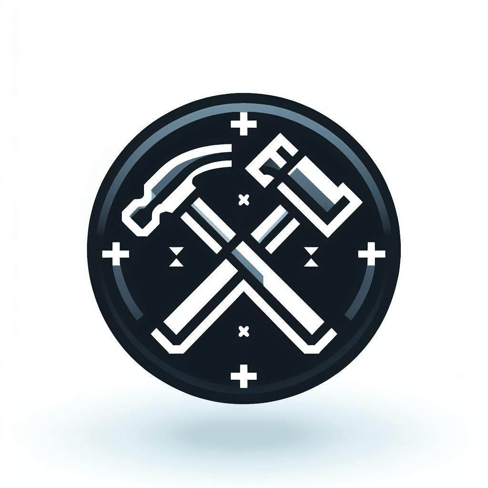

**StaffModeX**

Welcome to StaffModeX, the ultimate staff management plugin for Minecraft servers. Below is a list of features that will make StaffModeX stand out as the best choice for server administrators:

### Key Features:
1. **Comprehensive Staff Management:**
   - Enable staff members to enter a special mode with powerful tools and utilities.
   - Access to essential commands and functions tailored for staff tasks.

2. **Customizable Permissions:**
   - Flexible permission settings to define who can access StaffModeX features.
   - Fine-grained control over which staff members can use specific tools and commands.

3. **User-Friendly Interface:**
   - Intuitive GUI for easy navigation and use of StaffModeX functionalities.
   - Simplified controls for executing common staff tasks efficiently.

4. **Moderation Tools:**
   - Kick, ban, mute, or warn players directly from the staff mode interface.
   - Quick access to player information, history, and previous offenses.

5. **Monitoring and Logging:**
   - Real-time monitoring of player activity and chat within StaffModeX.
   - Logging of staff actions for accountability and review purposes.

6. **Teleportation Utilities:**
   - Instant teleportation to player locations for intervention or assistance.
   - Efficient teleportation between different areas of the server for staff convenience.

7. **Inventory Management:**
   - Seamless management of staff inventory, with the ability to access essential items on the fly.
   - Customizable inventory presets for different staff roles or tasks.

8. **World Editing Tools:**
   - Access to world editing commands for staff members tasked with building or managing server infrastructure.
   - Integration with popular world editing plugins for enhanced functionality.

9. **Reports and Tickets System:**
   - Built-in system for players to submit reports or assistance requests to staff members.
   - Streamlined interface for staff to manage and respond to player reports efficiently.

10. **Custom Commands and Macros:**
    - Define custom commands or macros for repetitive staff actions or server-specific tasks.
    - Simplify complex tasks with automated command sequences tailored to your server's needs.

11. **Security Enhancements:**
    - Protection against abuse or misuse of staff privileges.
    - Implementation of anti-griefing measures to safeguard server integrity.

12. **Integration with Other Plugins:**
    - Seamless integration with popular server management plugins for enhanced functionality.
    - Compatibility with a wide range of Minecraft server setups and configurations.

### Additional Features:
- **Staff Chat:** Enable staff members to communicate privately within StaffModeX.
- **Task Assignments:** Assign tasks or duties to staff members directly from the plugin interface.
- **Performance Optimization:** Ensure minimal impact on server performance through efficient code and resource management.
- **Customizable Appearance:** Customize the look and feel of the StaffModeX interface to match your server's theme or branding.

### Conclusion:
With StaffModeX, you'll have all the tools you need to effectively manage your Minecraft server staff and ensure a smooth and enjoyable experience for players. Stay tuned for updates and enhancements as we continue to develop and refine StaffModeX to meet the evolving needs of server administrators.

For more information and updates, visit our [official website](https://staffmodex.com) and join our community forums. We look forward to serving you with the best staff management solution for Minecraft servers!
